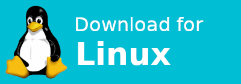

<h1 align="center">Prism</h1>

<div align="center">

[][latest-release-link]
[][latest-release-link]
[][latest-release-link]

</div>

<div align="center">

[][latest-windows-download-link]
[][latest-linux-download-link]

[^1] [^2]

</div>


[^1]: Windows and the Windows logo are registered trademarks of the Microsoft Corporation.
[^2]: Linux is the registered trademark of Linus Torvalds in the U.S. and other countries. Tux is the copyright of Larry Ewing \<<lewing@isc.tamu.edu>\>.

[latest-windows-download-link]: https://github.com/Amund211/prism/releases/download/v1.3.0/prism-v1.3.0-windows.exe
[latest-linux-download-link]: https://github.com/Amund211/prism/releases/download/v1.3.0/prism-v1.3.0-linux

[][latest-release-link]

## Download
Click one of the direct download buttons above, or [click here][latest-release-link] to go to the latest release.
Your browser might tell you that the file is potentially dangerous, but you can safely ignore this warning.
See the section on [safety](#safety) for more info.

## Description
Prism is an open source stats overlay for Hypixel Bedwars (not associated).
Prism will detect the players in your lobby as they join and when you type `/who`, and automatically show you their stats.
The overlay can be extended with the [Antisniper API](https://antisniper.net) (not associated) to denick some nicked players and display estimated winstreaks.

## Qualities
- Automatic party and lobby detection
- Good players sorted to the top and highlighted in red
- Fast
- Denicking (with Antisniper API)
- Winstreak estimates (with Antisniper API)

## Tips
- Enable autowho so you don't have to type `/who` when you join a filled queue
- Follow the instructions in the settings page to add an Antisniper API key to get denicking and winstreak estimates
- Click on the pencil next to a nicked teammate to set their username

## Known issues

### Show on tab doesn't work when holding shift
Some keys change when holding down shift (e.g. Shift+1 -> !).
Using these keys as the show on tab keybind may cause the overlay to not show when holding shift.
Letter keys (a, b, c, ...) and most special keys (Tab, Shift, Caps Lock, ...) should work regardless.

### Overlay window is invisible on Linux
This issue happens to me when I start the overlay and then fullscreen Minecraft.
I am able to fix it by simply switching workspaces away from and then back to Minecraft.
If this does not work there is a secret setting `disable_overrideredirect` that might help (see [this PR](https://github.com/Amund211/prism/pull/1)).
You can change this to `true` by editing the config file at `~/.config/prism_overlay/settings.toml`.

### Overlay takes focus when playing on Linux
This might be mitigated by the secret setting `hide_with_alpha`.
You can change this to `true` by editing the config file at `~/.config/prism_overlay/settings.toml`.
See [this PR](https://github.com/Amund211/prism/pull/1).

## Safety
Being open source, anyone can look at the source code for Prism to see that nothing nefarious is happening.
The released binaries are created using `pyinstaller` in GitHub Actions from a clean clone of the repository.
If you do not trust the released binary you can clone the project and run it from source by installing the dependencies and running `python3 prism_overlay.py` from the project root.
See [running the overlay from source](#running-the-overlay-from-source) for more info.

## Running the overlay from source
Note: make sure you have a recent version of Python installed.
The overlay currently depends on version `>=3.11`.

To run the project from source, perform the following steps:

### Clone the repository
```bash
git clone https://github.com/Amund211/prism
```

### Create and activate a virtual environment (optional)
Use a virtual environment to isolate this project from your system python install.
You have to activate the virtual environment each time you want to run the overlay.
Check [the docs](https://docs.python.org/3/library/venv.html#how-venvs-work) if you are having trouble activating the virtual environment.

```bash
python3 -m venv venv  # Create the virtual environment

# How to activate the venv depends on your OS and shell.
# Run one of the following
source venv/bin/activate      # linux/mac + posix sh

source venv\Scripts\activate  # windows + posix sh
venv\Scripts\activate.bat     # windows + cmd
venv\Scripts\activate.ps1     # windows + powershell
```

### Install the dependencies
```bash
# Run one of the following, replacing <os> with linux, mac or windows
pip3 install . -r requirements/<os>.txt  # For just running the overlay
pip3 install -e . -r requirements/<os>.txt -r requirements/<os>-dev.txt  # For running the overlay and doing development
```

### Run the overlay
```bash
python3 prism_overlay.py
```
Run `python3 prism_overlay.py --help` to get info about the accepted command line arguments.

[latest-release-link]: https://github.com/Amund211/prism/releases/latest
